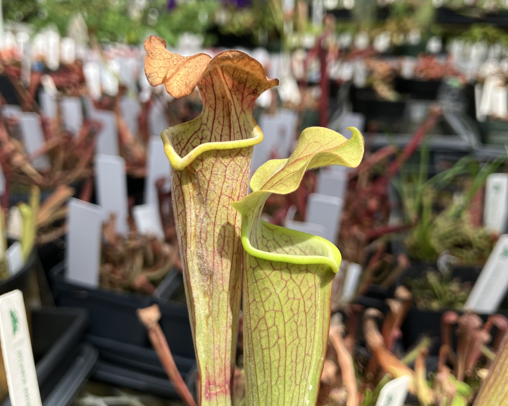
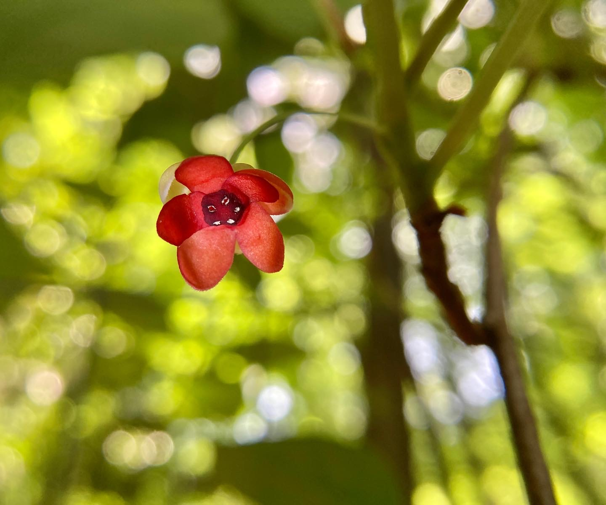

## Systematics and Conservation Genomics of Imperiled Wild Blackberries (*Rubus* sect. *Setosi*)

**Department of Ecology, Evolution, and Behavior / University of Minnesota**

*With Ya Yang, Welby Smith, and Mark Widrlechner*

As a graduate student at the University of Minnesota, I am studying the evolution, conservation genomics, and biogeography of a unique group of morphologically cryptic, peatland-associated wild blackberries (*Rubus* sect. *Setosi*). This group is distributed across the Great Lakes region, but there has been much debate over how many taxa actually occur in this group. *Rubus* are difficult to study due to the prevalence of hybridization, polyploidization, and apomixis across the evolutionary history of the genus.

As a part of my dissertation, I plan to assess patterns of population genomic structure for listed *Rubus* species in Minnesota and use niche modeling to assess climate vulnerability. I also aim to use morphological, genomic, and ecological approaches to offer an improved estimate of the number and distribution of species in this group. Finally, I'm hoping to use the evolution of *Rubus* subg. *Rubus* (which contains sect. *Setosi*) to ask questions about macroevolutionary patterns driving patterns of species rarity.

The Big Horseshoe Lake Bristleberry (*Rubus stipulatus*). Rice Co., MN.

## Conservation Genomics, Species Delimitation, and Biogeography of North American Pitcher Plants in the *Sarracenia rubra* species complex

**Southeastern Center for Conservation / Atlanta Botanical Garden**

*With Lauren Eserman-Campbell, Amanda Carmichael, and James Ojascastro*

As an NSF RaMP Trainee, I examined species delimitation in the *Sarracenia rubra* species complex, a taxonomically unresolved group of North American pitcher plants. This group includes three federally-listed Endangered taxa and two subspecies petitioned for listing under the Endangered Species Act. I am isolating DNA from plants in ABG's conservation safeguarding collection and local herbaria, then using whole genome sequencing to study phylogenomic relationships in this species complex.

In addition to my phylogenomic work, I used ecological niche models to assess patterns of niche overlap and climate vulnerability in two imperiled, narrowly-sympatric montane *Sarracenia*. This work was recently published in the [*American Journal of Botany*](https://doi.org/10.1002/ajb2.70194).

## Natural History and Conservation of American Starvine (*Schisandra glabra*)

**Dept. of Environmental Sciences / Emory University**

*With Carl Brown, Kirk Hines, Jack Kagan, and James Ojascastro*

I maintain a working relationship with staff at Emory University and AG Rhodes to digitize a 20-year phenology dataset for American Starvine (*Schisandra glabra*), an imperiled vine native to the Southeastern US and Hidalgo, Mexico. As a part of this team, we submitted a technical paper on a propagation protocol that was accepted to *Native Plants Journal.*

As an undergraduate at Emory, I previously mapped known populations at a field site and developed local habitat suitability models for a technical report for resource managers. In collaboration with ABG, we are extending this work to develop range-wide distribution models and forecasts of climate vulnerability.

## 
