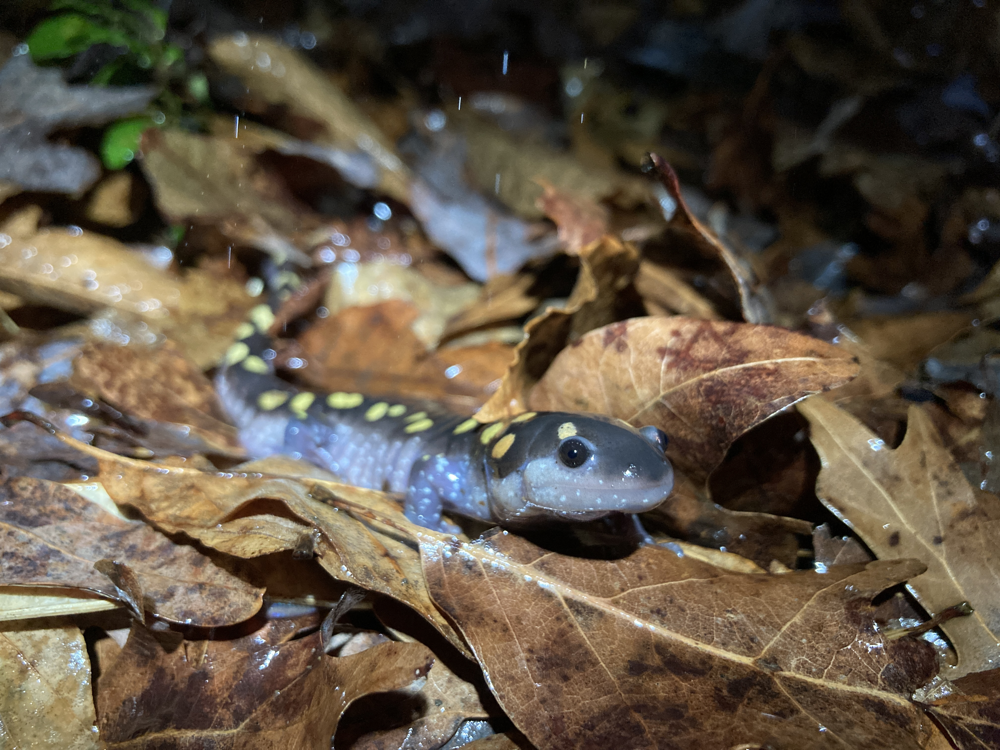

My name is Nick Chang and I'm currently a Ph.D. student in Ecology, Evolution, and Behavior at the University of Minnesota! I'm interested in using genomic, geospatial, and ecological tools to advance the conservation of North America’s rare plants. My doctoral research will use population genetics, molecular systematics, and niche modeling to inform the management of Minnesota’s imperiled wild blackberries (Rubus sp.), and to understand evolutionary drivers of species rarity. My previous work has involved amphibians, pitcher plants, and oysters in both natural and human-dominated contexts.

In addition to my scientific interests, I am passionate about leveraging field courses and community-engaged learning to connect students with applied questions in ecology and improve inclusivity and sense of belonging in undergraduate cohorts. As an undergrad, I participated in the Ecological Society of America’s SEEDS program, which has had a huge impact on me and other students.

Outside of the classroom/lab, I enjoy hiking, camping, growing unusual plants, aquarium keeping, and photographing salamanders and wildflowers.

You can reach me at chan2624\@umn.edu

\
*Ambystoma maculatum* from DeKalb Co., GA
